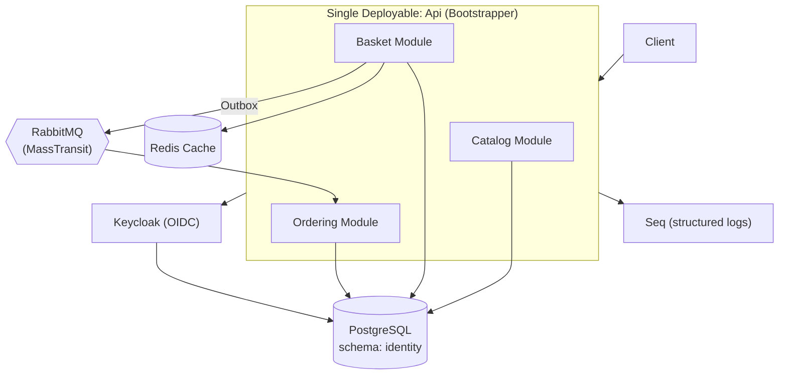

# eShop Modulith

A .NET 10 e-commerce application built as a **modular monolith**, applying Vertical Slice Architecture (VSA), Domain-Driven Design (DDD), CQRS, and the Transactional Outbox pattern — a companion project to [eshop-microservices](https://github.com/youssef-mohammed317/eshop-microservices), exploring the same domain under a different architectural style.

Unlike the microservices version, this system ships as a **single deployable process**. Catalog, Basket, and Ordering are independent modules with their own code, data access, and internal boundaries — but they run in one application, share one PostgreSQL database (via separate schemas), and communicate in-process through MediatR and RabbitMQ integration events, rather than over the network through separate services.

## Architecture



## Modules

| Module | Responsibility | Notes |
|---|---|---|
| **Catalog** | Product catalog (create, update price, browse) | Raises domain events (`ProductCreated`, `ProductPriceChanged`) consumed internally and published as integration events for other modules |
| **Basket** | Shopping cart and checkout | Reacts to `ProductPriceChanged` from Catalog to keep cached prices in sync; on checkout, writes an outbox message in the same DB transaction as the basket update, which a background service later publishes to RabbitMQ |
| **Ordering** | Order creation and lifecycle | Consumes the basket checkout integration event (via RabbitMQ) to create orders — the one place where communication crosses the process boundary asynchronously |

Each module exposes a `*.Contracts` project (currently `Catalog.Contracts`) — the only piece of a module other modules are allowed to reference directly. Basket references `Catalog.Contracts`, not `Catalog` itself, keeping the module's internals private.

## Tech Stack

- **.NET 10** across every module and the bootstrapper
- **CQRS** — MediatR-based commands/queries, feature-organized within each module (Vertical Slice Architecture)
- **Domain-Driven Design** — shared `Aggregate`/`Entity` base types, domain events dispatched via an EF Core `SaveChanges` interceptor
- **Carter** — minimal API endpoint routing
- **Entity Framework Core + PostgreSQL** — one physical database, one schema per module/concern (`catalog`, `ordering`, `identity` for Keycloak)
- **Transactional Outbox pattern** — Basket persists outgoing integration events to an `OutboxMessages` table in the same transaction as the business change, and a `BackgroundService` polls and publishes them to RabbitMQ — guaranteeing an event is never lost even if the broker is briefly unavailable
- **MassTransit + RabbitMQ** — integration events between modules (Basket → Ordering)
- **Keycloak** — OIDC authentication/authorization for the API
- **Redis** — distributed caching (Basket)
- **Microsoft.FeatureManagement** — feature flags
- **Serilog + Seq** — structured logging with a queryable log sink
- **FluentValidation** — request validation via a MediatR pipeline behavior
- **Mapster** — object mapping
- **Docker & Docker Compose** — orchestrates Postgres, Redis, RabbitMQ, Keycloak, Seq, and the API

## Design Patterns

- **Modular Monolith** — modules are logically isolated (own folder, own DbContext, own migrations) but deployed as a single process
- **Vertical Slice Architecture** — each module organizes code by feature rather than by technical layer
- **Domain-Driven Design** — aggregates raise domain events on state changes; an EF Core interceptor dispatches them after `SaveChanges`
- **CQRS** — commands and queries are modeled and handled separately
- **Transactional Outbox** — guarantees at-least-once delivery of integration events without a distributed transaction
- **Module boundary via Contracts projects** — cross-module references only go through a module's public `Contracts` assembly, never its internals

## Running Locally

The whole stack — Postgres, Redis, RabbitMQ, Keycloak, Seq, and the API — is wired up in `docker-compose.yml` / `docker-compose.override.yml`.

```bash
cd src
docker compose up -d --build
```

Once containers are up:

| Service | URL |
|---|---|
| API | http://localhost:6000 |
| Keycloak | http://localhost:9090 (admin/admin) |
| Seq (logs) | http://localhost:9091 |
| RabbitMQ Management UI | http://localhost:15672 (guest/guest) |
| PostgreSQL | localhost:5433 |
| Redis | localhost:6380 |

## Project Structure

```
src/
├── bootstrapper/
│   └── Api/                          # Single entry point — wires up all modules
├── modules/
│   ├── catalog/
│   │   ├── Catalog/                  # Catalog module implementation
│   │   └── Catalog.Contracts/        # Public surface other modules can reference
│   ├── basket/
│   │   └── Basket/                   # Basket module + outbox pattern
│   └── ordering/
│       └── Ordering/                 # Ordering module
├── shared/
│   ├── Shared/                       # DDD base types, EF interceptors, pagination
│   ├── Shared.Contracts/             # CQRS abstractions, pipeline behaviors, exception handling
│   └── Shared.Messaging/             # MassTransit/RabbitMQ setup, integration events
├── init.sql                          # Creates the identity/ordering DB schemas
└── docker-compose.yml
```

## Related Project

This is the modular-monolith counterpart to [eshop-microservices](https://github.com/youssef-mohammed317/eshop-microservices), which implements the same domain as fully independent microservices behind an API Gateway, each with its own database.

## Course & Certificate

This project was built while following [.NET Backend Bootcamp: Modulith, VSA, DDD, CQRS and Outbox](https://www.udemy.com/course/net-backend-bootcamp-modulith-vsa-ddd-cqrs-and-outbox/?couponCode=KEEPLEARNING) on Udemy.

- 🎓 Certificate: [View here](https://drive.google.com/file/d/1_wAItBOD8Gtzo6XbzFUMALi6R6WR1smX/view?usp=drive_link)

## Repository

🔗 [github.com/youssef-mohammed317/eshop-modulith](https://github.com/youssef-mohammed317/eshop-modulith)

## License

See [LICENSE](LICENSE).
